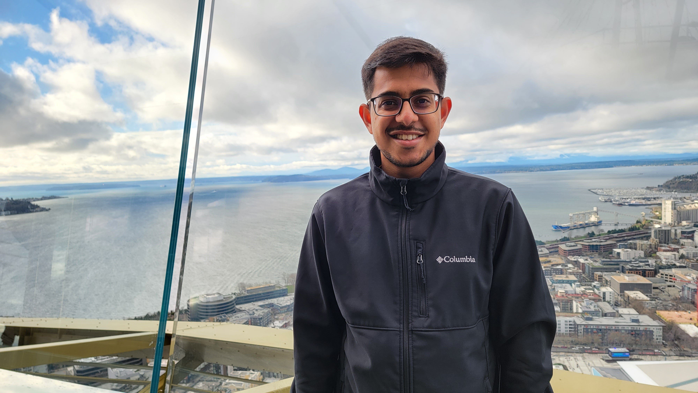
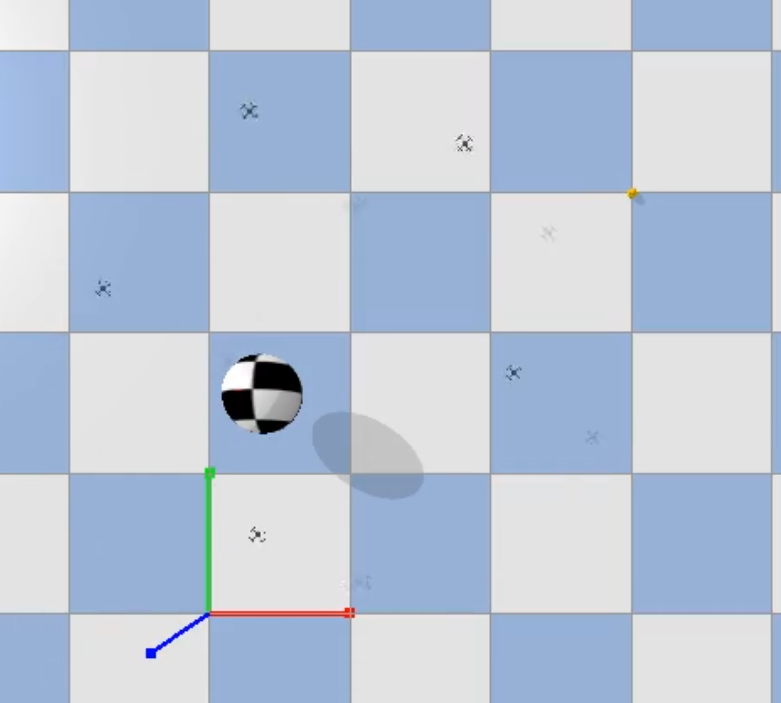

### About Me

Hello there! I am Parth Khopkar, an ML Engineer at RadiusAI where I am working on making retail store operations more efficient using machine learning.

I like to automate things and bring order to chaos. Trying to get my code to do exactly as I want by reading more and more fills up most of my days.

I will be more than happy to talk to you if you reach out to me via [email](mailto:parth.khopkar@gmail.com)

### Previous work

#### Masters Thesis
*Work done as part of my Master of Science in Computer Science degree at Arizona State Unviersity's School of Computing and Augmented Intelligence (formerly CIDSE). I was advised by [Dr. Heni Ben Amor](http://henibenamor.weebly.com/) and [Dr. Siyu Zhou](http://emergence.asu.edu/siyu-zhou.html)*

My thesis focused on using imitation learning to control a swarm of drones so that they can avoid obstacles in a simulated environment and reach the desired goal location. A graph neural network (GNN) based controller learns to imitate how birds flock together in nature and is then used to decide the velocity that each drone should target.

This work was a featured project under ASU's MORE program. Read more about that [here](https://furi.engineering.asu.edu/participant/khopkar-parth/).

[[Thesis](https://hdl.handle.net/2286/R.2.N.161716), [Slides](./assets/files/Parth_Khopkar_Masters_Thesis_Presentations-final.pptx)]