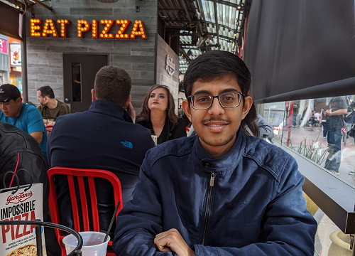

Hello there! I am Parth Khopkar, a Master's student at [Arizona State University](https://www.asu.edu/), researching how multi-agent AI can help humans with complex and dangerous tasks such as search and rescue.

I like to automate things and bring order to chaos. Trying to get my code to do exactly as I want by reading more and more fills up most of my days.

I will be more than happy to talk to you if you reach out to me via [email](mailto:parth.khopkar@gmail.com) or [Twitter](https://twitter.com/parthkhopkar)